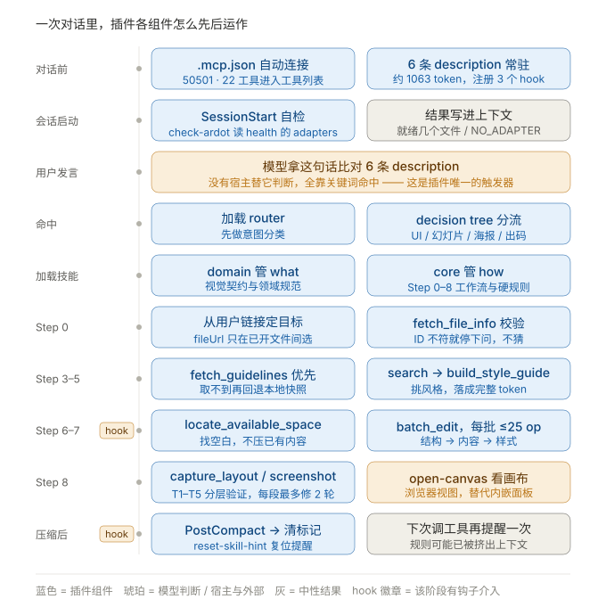

# ardot-design —— Claude Code 插件

把 Ardot 画布设计能力接进 Claude Code：读写设计稿、由设计稿出前端代码。

**自用插件，不对外分发** —— 技能内容提取自 WorkBuddy 安装包（腾讯专有内容）。

> 📌 本目录既是**源码目录**也是**插件本体**。
> 安装方式：整个目录拷到 `~/.claude/skills/ardot-design/`。

---

## 装了之后有什么

`claude plugin details ardot-design` 的实测输出：

```
Skills (6)       ardot-design-core, ardot-design-router, ardot-design-to-code,
                 ardot-poster, ardot-slides, ardot-ui-design
Hooks (3)        SessionStart, PreToolUse, PostCompact
MCP servers (1)  ardot-desktop
Always-on        ~1,063 tok
```

| 组件 | 提供什么 |
|---|---|
| `skills/` | **脑** —— 6 个包 26 文件。8 步工作流、设计规则、风格黑名单、出码流程 |
| `.mcp.json` | **手** —— 插件启用时自动连 `127.0.0.1:50501`，22 个工具直接可用 |
| `bin/` | **眼** —— `open-canvas` 成为 PATH 里的裸命令，随时打开画布 |
| `hooks/` | **三道闸** —— ① 会话开始自检画布服务；② 调用画布工具时提醒"规则加载了没"；③ 压缩后把 ② 复位 |

### 三个 hook 分别在防什么

| hook | 时机 | 防的问题 |
|---|---|---|
| `SessionStart` → `check-ardot` | 会话开始一次 | 画布服务没起 / 没打开设计文件，模型不知情就动手 |
| `PreToolUse` → `check-skill-loaded` | 调用画布工具时，**每会话一次**（Qoder lazy-load 下 `tool_name` 恒为元工具 `mcp_call`，靠 matcher `mcp_call|mcp__.*ardot.*` 放行 + 脚本自检 stdin 内容过滤） | 「手在、脑没跟上」——MCP 启用即连，22 个工具第一回合就可见；但 skill 要靠关键词命中才加载。两者不同步时模型可能直接 `batch_edit` 而不知道 ≤25 op / 分层验证这些硬规则 |
| `PostCompact` → `reset-skill-hint` | 上下文压缩完成后 | 压缩把早期消息总结掉，规则正文可能随之出上下文；但工具定义每轮重新注入。这时最需要 ② 那句提醒，而 ② 的标记是按 `session_id` 建的、压缩前后不变 → 会被永久屏蔽。本 hook 删掉标记，把 ② 复位 |

`check-skill-loaded` 用 `session_id` 打标记去重，不会每次工具调用都刷屏；
`reset-skill-hint` 只清当前会话的标记，不影响并发的其它会话。
拿不到 `session_id` 时，前者退化为最多每 5 分钟一次，后者退化为全清。

> ⚠️ **这道闸的价值未经验证。**「skill 正文会被压缩掉」是推断，不是实测
> （压缩确实会发生，`PostCompact` 事件的存在就是证据；但 skill 内容是否真会丢，没验过）。
> 三行代码、零运行时成本，当保险留着，别当救命稻草。

**常驻成本只有约 1,063 token**（只加载 6 个技能的 description），
完整内容在命中时才加载（core 约 3.4k）。很划算。

---

## 一次对话里，插件怎么运作

以用户的一条消息为时间线，看各组件先后怎么动：



图上四件值得单独说的事：

**① 用户开口之前，插件已经跑了两步。**
`.mcp.json` 连上 MCP、6 条 description 进常驻上下文、3 个 hook 完成注册——都在对话开始前。
所以模型第一回合就能看到 22 个工具，这不是被"触发"出来的，是一直在那儿。

**② 整条线上只有一个地方靠猜。**
就是「用户发言 → 比对 description」。宿主版在这一步由宿主直接注入，插件版只能靠关键词命中。
这是整套移植里唯一真正降级的环节，其余都等价。

**③ hook 只在两个点介入。**
`Step 6–7`（首次调 `batch_edit`）和压缩后。其余八个阶段 hook 完全不参与——
它们不是驱动流程的，是在两个容易出事的节点上各补一句客观状态。

**④ 图里没画出来的：Step 7–8 是个循环。**
实际执行是每个区块走一遍「结构 → 内容 → 样式 → 验证」，不是画一次就完。
收敛阈值（每段最多修 2 轮、忽略 ≤4px 噪声）管的就是这个循环。

三个组件顺着时间线的分工：

| 组件 | 在线上的位置 | 角色 |
|---|---|---|
| `.mcp.json` | 全程常驻 | **手** —— 通道一直开着 |
| `skills/` | 命中之后到结束 | **脑** —— 规定怎么用这些手 |
| `hooks/` + `bin/` | 会话启动 / 首次调工具 / 压缩后 | **闸** —— 三个点各补一句客观状态 |

> 图源文件是 `docs/timeline.svg`，自带样式（不依赖任何外部 CSS），改完直接替换即可。

---

## 安装

```bash
rm -rf ~/.claude/skills/ardot-design
cp -r ardot-agent-kit ~/.claude/skills/ardot-design
# 新开一个会话即生效（skills-dir 插件下次会话自动加载）
```

改源码时用软链更方便：

```bash
ln -s "$(pwd)/ardot-agent-kit" ~/.claude/skills/ardot-design
```

验证：

```bash
claude plugin details ardot-design
```

### Qoder

同一目录、双清单并存，与 Claude Code 共用一份源码：

```bash
qoder plugins install /path/to/ardot-agent-kit
```

装完执行 `/plugins reload` 生效。hooks 变量已做双宿主兼容：
`QODER_PLUGIN_ROOT` / `CLAUDE_PLUGIN_ROOT` 哪个存在用哪个，无需分叉维护。

### ZCode

同一目录直接可用（ZCode 认 `.claude-plugin/` 清单；`skills/`、`hooks/hooks.json`、
`.mcp.json` 三个组件位置均有默认发现逻辑，清单无需声明组件字段）。
安装：**Discover 页 → `+` → 本地目录**。装完确认三处：

- **Settings → Skills**：6 个 ardot 技能在列
- **插件详情页**：SessionStart / PreToolUse 两个 hook 为 runnable；
  PostCompact 显示 unsupported 警告属预期（ZCode 只支持 7 个事件，没有 PostCompact）
- **Settings → MCP**：`ardot-desktop` 自动连上（22 个工具）

> ⚠️ 装插件**前**记得移除用户级的 ardot MCP，否则工具名会重复：
> `claude mcp remove ardot-desktop --scope user`

> 🟢 **Windows 兼容性已修（2026-09-02）**：ZCode 在 Windows 上用 `%ComSpec%`（cmd.exe）
> 执行 command hook（`zcode.cjs` 的 `resolveShell` 核实：hook 不带 `shellProfile:"posix-bash"`
> 就到不了它的 git-bash 提供方），而本插件三个 hook 都是 POSIX 一行式，进 cmd 必败
> （实测 `exit=1`）。修法：三条 hook 均已加
> `"shell": "D:/appdevelop/git/Git/bin/bash.exe"`——ZCode 对字符串 shell 直接采信为
> spawn shell，一个字段强制走 bash。⚠️ **路径钉死了本机 Git 安装位置，换机器必改**；
> 裸 `bash` 不许用（PATH 上的 System32\bash.exe 是 WSL stub，会静默死）。
> 实测：ZCode ✅（会话注入 + hook 注册记录双证）、Qoder ✅（注入 + PreToolUse 提醒
> 双证，未知键被容忍）、Claude Code 未实测（本机未装 Claude 版插件，无现存状态可破坏）。

---

## 用法

装完后直接说需求即可，router 会自动分流：

```
用 ardot 画一个健身 App 的数据看板
按这份设计稿生成 React：https://ardot.tencent.com/file/719793184410961
检查一下这个页面有没有布局问题
```

看画布（插件已把 `bin/` 加进 PATH）：

```bash
open-canvas                        # 打开当前活跃文件
open-canvas 719793184410961        # 打开指定文件
```

---

## 目录

```
ardot-agent-kit/                   ← 插件根目录
├── .claude-plugin/plugin.json     ← 插件清单
├── .mcp.json                      ← 自动注册 ardot-desktop（22 工具）
├── bin/
│   ├── open-canvas                ← 浏览器打开画布
│   ├── check-ardot                ← 会话启动自检（hook 调用）
│   ├── check-skill-loaded         ← 工具调用前提醒加载规则（hook 调用）
│   └── reset-skill-hint           ← 压缩后复位上一条的提醒标记（hook 调用）
├── hooks/hooks.json               ← SessionStart / PreToolUse / PostCompact 三个事件
├── skills/                        ← 6 包 / 26 文件（+ PORT-NOTES）
│   ├── PORT-NOTES.md              ← agent 先读这个
│   ├── ardot-design-core/ (10)    ← 30KB 设计规则 + 风格指南 + 特效 + 语法
│   ├── ardot-ui-design/ (5)       ← 落地页 / Web App / 移动端 / 表格
│   ├── ardot-design-to-code/ (5)  ← 出码工作流 + 网站风格提取
│   ├── ardot-slides/ (3)
│   ├── ardot-poster/ (2)
│   └── ardot-design-router/ (1)   ← 意图分发
├── docs/
│   └── timeline.svg               ← 一次对话的完整运作时间线图
├── scripts/
│   ├── detect-ardot.sh            ← 探测本机 MCP 端口
│   ├── open-canvas.sh             ← 迁移到其他 agent 时用的退路
│   └── check-refs.py              ← 技能包静态自检（引用/工具名/frontmatter/数字）
├── .gitignore                     ← 常规忽略规则（Python / OS 垃圾文件）
└── install.sh                     ← 老式安装（非插件场景仍可用）
```

> 曾有过一个 `tools/capture-create-api.py`（抓包逆向建文件接口），**已删除**。
> 放弃理由：建文件不等于能操作——通路 A 的 `fileUrl` 只能在**客户端已经打开的文件之间
> 做选择**，打不开没打开的文件（实测传未打开的 ID 会报 `NO_ADAPTER`）。所以就算逆向出
> 建文件接口，建完还是得手动在客户端打开，与直接手动新建无差别；且其输出含登录态。
> 从零起稿请走「仍然存在的差距」里写的两条路。
>
> 更正：早期版本这里写的是「Ardot 客户端不支持 fileId」——严格说对，但容易误读。
> A 只是不认 `fileId` 这个键名，它用 `fileUrl`，且 **19 / 22 个工具都支持**。
> 详见 `skills/ardot-design-core/SKILL.md` → Step 0。
脚本本身无第三方依赖，不装也能留着看逻辑。

---

## 三条 MCP 通路

插件默认只接 **A**。需要 `create_design` 从零起稿时才手动加 **B**。

| | A · Ardot 客户端 | B · WorkBuddy 内置 | C · 云端 |
|---|---|---|---|
| 端点 | `127.0.0.1:50501` | `127.0.0.1:50551` | `ardot.tencent.com/mcp` |
| 工具 | **22** | 20 | 未实测 |
| 从零起稿 | ❌ | ✅ `create_design` | ❌ |
| 依赖 | Ardot 客户端 | WorkBuddy | 无 |
| 官方承诺 | ✅ | ❌ 内部实现 | ✅ |

加 B：

```bash
claude mcp add ardot-local --transport http http://127.0.0.1:50551/api/v1/mcp --scope user
```

工具集互补：共有 17，**仅 A** 有 `export_variables` / `fetch_guidelines` / `fetch_styles` / `html_to_ardot` / `register_assets`，**仅 B** 有 `create_design` / `open_design` / `save_tokens`。并集 25。

其中 `fetch_guidelines` 已经接进工作流——通路 A 上 `ardot-design-core` 的 Step 3 会**优先调它取官方活版本**，取不到才回退本地 `guidelines-*.md` 快照。8 个 topic 与本地文件的对应关系见 `skills/PORT-NOTES.md`。另外三个仍未被任何工作流调用。

> 📌 官方文档写「18 个工具」已过时，2026-09-01 实测是 22（08-29 是 21，客户端升级加了 `fetch_styles`）。**以 `tools/list` 实测为准。** <!-- skip-ref-check -->

---

## 迁移到其他 agent

**插件主体三家 agent 都认**（Qoder 于 2026-08-29、ZCode 于 2026-09-01 对照官方文档与运行时源码核实），
只有清单文件名各家不同，放两份即可：

| 零件 | Claude Code | Qoder |
|---|---|---|
| `skills/`（SKILL.md + YAML frontmatter） | ✅ | ✅ 同一开放标准 |
| `.mcp.json` | ✅ 自动注册 | ✅ 同格式自动注册 |
| `bin/` | ✅ 自动进 PATH | ✅ 插件组件 |
| `hooks/hooks.json` | ✅ `${CLAUDE_PLUGIN_ROOT}` | ✅ `${QODER_PLUGIN_ROOT}`，命令已写成双变量自动选择 |
| 清单 | `.claude-plugin/plugin.json` | `.qoder-plugin/plugin.json`（两份并存于同一目录） |

### 通用配方（换任何 agent 都这么做）

1. 把 `skills/` 里 6 个包拷到该 agent 的技能目录
2. 用它自己的 MCP 命令注册 `http://127.0.0.1:50501/api/v1/mcp`
3. 看画布用 `scripts/open-canvas.sh`（不依赖 `bin` 机制）
4. **务必让 agent 先读 `skills/PORT-NOTES.md`** —— 三条通路差异和排障都在里面

> `install.sh` 只服务 Claude Code（注册 MCP + 拷技能）。其他 agent 按上面四步手动来。

### ⚠️ hook 不可移植——它的三道闸只在插件宿主上有

三个 hook 干的都是「把客观状态主动塞进上下文」。这是**插件宿主才有的能力**，
不是 skill 能自己实现的。迁移到没有 hook 机制的 agent 时三道闸全失效：

| 宿主 | `SessionStart` | `PreToolUse` | `PostCompact` | 依据 |
|---|---|---|---|---|
| **Claude Code** | ✅ | ✅ | ✅ | 原生支持，`.claude-plugin` 下的 `hooks/hooks.json` |
| **ZCode** | ✅ | ✅ | ❌ 不在 7 个支持事件内，加载时仅警告跳过 | 官方 `diagnosing-hooks` 文档 + `zcode.cjs` 源码核实 |
| **Qoder** | ✅ | ✅ | ✅ | 2026-08-29 核实：官方 hook 文档 + 运行时 `qoder-worker-runtime.obf.mjs`，三个事件都在事件表里 |
| **Cursor** | ❌ | ❌ | ❌ | 只有 `.cursor/rules/*.mdc`，没有生命周期 hook |
| **Codex** | ❌ | ❌ | ❌ | 只认 `AGENTS.md`，已停止支持 |
| 其它通用 agent | ❌ | ❌ | ❌ | 无 hook 机制 |

> ⚠️ 表里的 ✅ 只回答「宿主支持这个事件、会去调 command」，不回答「这条 command 跑不跑得起来」。
> Windows 上的第二问要问一句：这个宿主用 bash 还是 cmd.exe 执行 command hook？
> Claude Code 与 Qoder 走 bash（本插件的 POSIX 一行式实测有效）；ZCode 走 `%ComSpec%`，
> 曾因此全军覆没——现已用 hook 条目里的 `"shell": "<bash 绝对路径>"` 修复
> （见上面 ZCode 安装节的 🟢 说明），Qoder/ZCode 对该字段实测均容忍。

#### Qoder hook 官方文档在哪

Qoder 把 hook 官方文档**随安装包一起发**了，直接读这个文件（2026-08-29 核实）：

```
<Qoder 安装目录>/resources/app.asar.unpacked/node_modules/
  @qoder-ai/qoder-agent-sdk/dist/_worker/builtin/hook-config/SKILL.md
```

本机实测路径：
```
E:/appdevelop/Qoder/resources/app.asar.unpacked/node_modules/@qoder-ai/qoder-agent-sdk/dist/_worker/builtin/hook-config/SKILL.md
```

事件约 23 个，比 Claude Code 多出 `PostToolUseFailure` / `CwdChanged` /
`InstructionsLoaded` / `FileChanged` / `PermissionRequest` / `ConfigChange` /
`TeammateIdle` / `StopFailure` / `TaskCreated` / `TaskCompleted` 等。
`matcher`（工具名正则）、`timeout`、`if` 条件、四种 handler 类型
（`command` / `http` / `prompt` / `agent`）两家通用。

其它要点（都出自上面那份文档）：

| 项 | 说明 |
|---|---|
| 退出码 | `0` 成功 / `2` 阻断（stderr 为原因）/ 其它非阻断错误 |
| 占位符 | `${QODER_PROJECT_DIR}` `${QODER_PLUGIN_ROOT}` `${QODER_PLUGIN_DATA}` 以**环境变量**导出；**bash 形态下不预替换**，命令里必须双引号包裹 |
| exec 形态 | 设了 `args` 就绕过 shell 直接执行，不做分词/glob，适合路径含特殊字符时 |
| `if` 条件 | `"ToolName(glob)"`，如 `"Bash(git commit:*)"`；比 matcher 更细 |
| `asyncRewake` | 后台 hook，`exit 2` 可唤醒模型 |

> ⚠️ 别用 `app.asar` 里的事件枚举当准绳 —— 那是某个 bundle 的**校验白名单**（18 个），
> 真正的发射逻辑在 `qoder-worker-runtime.obf.mjs`，事件更多。

#### `InstructionsLoaded` 的确切语义（2026-08-29 挖到底）

**它是什么**：「某个 **AGENTS.md 类指令文件**被装载进上下文」时触发。Qoder 用的文件名是
`AGENTS.md`（运行时里 `AGENTS.md` 出现 7 次，`CLAUDE.md` / `QODER.md` 各 0 次）。

**触发链**（运行时 `qoder-worker-runtime.obf.mjs`）：

```js
let n = n2e(await this.discoverMemoryPaths(), [...this.config.getAgentsMdExcludes()]);
let { contentsMap: r, allContents: o, importParentMap: s } = await this.loadMemoryContents(n);
this.categorizeMemoryContents(n, r);
...
this.fireInstructionsLoadedHooks(n, r, A, s)     // ← 全运行时唯一的调用点
```

**载荷**：`fireInstructionsLoadedEvent(path, source, loadReason, extra)`

| 字段 | 取值 |
|---|---|
| `path` | 指令文件路径 |
| `source` | `User` / `Managed` / `Project` / `Local` —— 四层来源 |
| `loadReason` | `session_start`（默认）/`nested_traversal`（遍历到子目录）/`include`（被 `@import` 引入）/`path_glob_match`（文件 frontmatter 里有 globs 且命中） |
| `extra` | `globs`（path_glob_match 时）或 `parentFilePath`（include 时） |

**去重**：`hookFiredPaths` 集合，**每个文件每会话只发一次**。
**短路**：`getHooksForEvent("InstructionsLoaded").length === 0` 时整个函数直接 return。

**能在技能加载时触发吗？不能。** 三条证据：

1. **全运行时只有一个调用点**，在 `discoverMemoryPaths() → loadMemoryContents()` 这条链上
2. 四层来源是 `A.global / A.plugin / A.project / A.local`，都是**指令文件层级**，不是 skill
3. 路径过滤走 `config.getAgentsMdExcludes()` —— 明确是 AGENTS.md

技能是通过 **Skill 工具**加载的（运行时里 `loadSkill` 出现 41 次），那属于工具调用，
走 `PreToolUse` / `PostToolUse`，**不会**碰 `InstructionsLoaded`。

→ 结论：它回答不了「core 加载了没」。`check-skill-loaded` 只能提醒、不能确认。

> 想真检测的话，理论上可在 `PreToolUse` 上再加一条 `matcher: "Skill"` 的 hook，
> 把加载过的技能名记进 per-session 标记文件，让 `check-skill-loaded` 查该文件。
> 但 Qoder 里 Skill 工具的**确切名称**尚未核实（运行时只有 `loadSkill` / `SkillTool` 等
> 内部标识符），要做的话得先确认。

#### ⚠️ command hook 的 stdout 必须是 JSON

两家宿主都把 command hook 的 **stdout 当 JSON 解析**。官方文档把「非 JSON stdout」
明确列为 anti-pattern（"Stdout pollution — Non-JSON stdout causes parse errors"）。
所以 `bin/` 下两个脚本都走正式契约：

```json
{"hookSpecificOutput":{"hookEventName":"PreToolUse","additionalContext":"..."}}
```

`hookEventName` 必须与注册的事件名一致，否则 `additionalContext` 会被丢弃。
调试输出一律走 stderr。`reset-skill-hint` 不需要输出，就什么都不打。

#### ⚠️ Windows 上 `rm` 删不掉 `TEMP` 里的文件

`TEMP` / `TMP` 在 Windows 上给的是 `C:\Users\...` 这种**反斜杠**路径。
shell 自己的重定向和 `[ -e ]` 能解析它，但 **`rm` 是外部二进制，把反斜杠当字面字符**——
结果是 `rm -f` 静默失败，文件还在。这个坑不会报错，只会让「清标记」悄悄失效。

两个脚本都在取到临时目录后统一归一化成 POSIX 形式：

```bash
case "$TMPROOT" in
  ?:\\*) TMPROOT="/$(printf '%s' "${TMPROOT%%:*}" | tr 'A-Z' 'a-z')$(printf '%s' "${TMPROOT#?:}" | tr '\\' '/')" ;;
esac
```

以后往 `bin/` 加脚本、只要用到临时目录，照抄这段。

**闸失效后的退化方案**：把约束写进常驻规则，靠文档兜底。

- Cursor / 通用：在 `AGENTS.md`（或用 `alwaysApply: true` 的 `.mdc`）里放一段固定提示，
  效果约等于 `PreToolUse` 提醒的一半——它在会话开始就说，而不是"要用工具时才说"，
  所以会占常驻上下文，且容易在长会话里被稀释。
- 无论哪个 agent，`PORT-NOTES.md` 里的硬规则和 router 的 decision tree 都是最后一道防线。

### Cursor

Cursor 用 `.cursor/rules/*.mdc`（**必须是 `.mdc` 后缀，`.md` 会被直接忽略**），
frontmatter 取 `description` / `globs` / `alwaysApply` 三字段。

格式不同需二次转换，建议只搬最关键的几份：

```
.cursor/rules/
├── ardot-core.mdc          ← 合并 SKILL.md Step 0 + PORT-NOTES 工具差异
├── ardot-style.mdc         ← rules/style-guide.md（AI 味黑名单）
├── ardot-design-rules.mdc  ← rules/design-rules.md（30KB，需按章节拆）
├── ardot-batch-edit.mdc    ← tool-usage/batch-edit.md
└── ardot-to-code.mdc       ← design-to-code 工作流
```

> Cursor 官方明确建议：**单条规则控制在 500 行以内**，大规则必须拆。
> 30 KB 的 `design-rules.md` 直接塞进一个 `.mdc` 会超。
> 也可以用项目根目录的 `AGENTS.md` 做简化版（Cursor 支持）。

---

## 仍然存在的差距

| 差距 | 状态 |
|---|---|
| 没有内嵌画布面板 | 🟡 `open-canvas` 用浏览器补，Ardot 实时协作会同步刷新 |
| 不能从零起稿 | 🟡 需手动建文件，或加 B 通路 |
| ~~不能框选节点对话改局部~~ | ✅ **已解决**（实测）—— 在 Ardot 客户端里框选，`fetch_editor_state` 能返回选区；仅在浏览器里框选无效 |
| AI 素材生成 | 🔴 WorkBuddy 有内置 ImageGen/VideoGen，这边没有 |

---

## 卸载

```bash
rm -rf ~/.claude/skills/ardot-design
```

---

## 排障

```bash
curl http://127.0.0.1:50501/api/v1/health    # A
curl http://127.0.0.1:50551/api/v1/health    # B（返回里有 "status":"ok"）
```

- **`adapters: 0`** → 客户端没打开设计文件，画布工具会报 `NO_ADAPTER`。
  **这是最常见的卡点** —— 必须先在 Ardot 客户端里打开一个文件。
- **连不上** → 客户端没运行
- **工具数不对** → 连错端口，A=22 / B=20
- **Windows 上 `open-canvas` 弹 cmd 窗口** → 已修（改用 `explorer.exe`，别用 cmd 的 `start`）

组件差异细节见 `skills/PORT-NOTES.md`。

---

## 维护 —— 改完技能跑一次自检

```bash
python scripts/check-refs.py          # 内置工具快照，离线可用
python scripts/check-refs.py --live   # 实测本机 MCP，与内置快照取并集（只开一条通路也能跑）
python scripts/check-refs.py -q       # 只报问题
```

退出码 `0` = 全过，`1` = 有问题。可直接挂 git pre-commit：

```bash
cp scripts/git-hooks/pre-commit .git/hooks/pre-commit
```

查五类问题：

| 检查 | 抓什么 |
|---|---|
| **路径引用解析** | `{SKILL_ROOT}/...` 和 `../...` 是否真能解析到存在的文件 |
| **工具名有效性** | 反引号里疑似工具名的东西，是否真在那 25 个工具清单里（默认用内置快照，`--live` 时并入实测） |
| **frontmatter** | 6 个技能是否都有 `name` + `description`，有无残留 `disable-model-invocation` / `allowed-tools` |
| **README 数字** | 「6 个包 N 文件」「Hooks (N)」「core (N)」是否与实际相符 |
| **全仓数字口径** | 任何文件里写死的工具数与比例（含 `bin/`、`install.sh`、`docs/` 的图）是否与 `CANON` 真值相符 |

### 为什么需要它

第一轮移植时，`slides-workflow.md` 里 5 处 `../ardot-design-core/...` **全部指向不存在的目录**。
上游用 `<ardot-design-core>/xxx` 占位符（绝对路径由宿主注入，与文件深度无关），
改成相对路径后，子目录里的文件要多上一级。**这玩意识别不出来——读起来完全合理。**

自检脚本就是为这个写的，已做回归测试：注入四类 bug（路径层级错 / 虚构工具名 / 删 frontmatter /
数字过期）都能精确报出文件和行号。

第二个动因是 2026-09-01：Ardot 客户端升级把通路 A 的工具数从 21 提到 22，全仓 6 处写死的
数字同时过期 —— 而当时的自检**照样报「41 项全过」**。它只 walk `skills/` 查路径与工具名，
数字仅在 README 里比，`bin/`、`install.sh`、`docs/` 的图根本不在射程内。
「全过」和「6 处过期」同时成立，就是第 5 项检查要堵的那个洞。

第三个动因是 2026-09-02 凌晨：`--live` 只连着通路 A 时，把 B 独有的 `create_design` 等三个工具
在文档里的正当引用整批判成「虚构工具名」，实跑 35 条假问题、exit 1。没应答的通路不等于
没有工具 —— 现在 `--live` 判的是「实测 ∪ 快照」，单通路在线时差集只出「提示」行，
两条通路都应答而对不上才算过期。

### 豁免标记

文档里的**示例**路径、示例工具名、以及**引用旧口径的历史叙述**，都不是当前声明 —— 在行尾加
`<!-- skip-ref-check -->` 跳过该行，五类检查一起豁免。
最典型的用法就是引用官方旧口径那句「官方文档写 18 个工具已过时」 <!-- skip-ref-check -->
已用在：`PORT-NOTES.md` 的路径规则表，以及 `README.md`、`PORT-NOTES.md` 各一处旧口径引用。

### 维护约定

- 新增了不是工具名、但长得像工具名的词 → 加进脚本里的 `ALLOWED_NON_TOOLS`，**并写清理由**
- 技能文件增删 → 同步改 README 里的数字，否则自检会报
- 内置工具快照与数字口径真值表（`TOOL_SNAPSHOT` / `CANON`）都在 `scripts/check-refs.py` 顶部。
  Ardot 升级后跑一次 `--live` 核对，改数字时两处一起改 —— 第 5 项会把全仓要改的点全列出来
- `--live` 只连上一条通路也能跑：未应答通路的独有工具由快照兜住，两边差集打成「提示」行而不是
  问题。只有两条通路都应答、快照仍与实测对不上，才是真过期

## 打包

应打包集合 = git 跟踪清单 − `.workbuddy/`（当前 42 文件）。单独存成 `scripts/package-manifest.txt`，
校验时只认这份清单，不重新算 —— 避免「用同一份过滤结果既铺 staging 又核对包内成员」的自证陷阱。

```bash
python scripts/package.py                        # 打包 + 按清单校验
python scripts/package.py --write-manifest       # 有意增删技能文件后，改写清单（会显示 diff 要求确认）
python scripts/package.py --write-manifest --yes # 跳过确认（CI / 脚本调用）
python scripts/package.py --allow-untracked      # 有未跟踪文件也照样打包（默认直接失败）
```

退出码 `0` = 打包 + 校验全过，`1` = 中止或校验失败。校验三项：包内成员与清单双向相符、
内容与磁盘逐文件 SHA-256 一致、权限位统一 `0o100666`。

Windows 上必须用 `C:\Windows\System32\tar.exe`（bsdtar）出 zip —— Git Bash 自带的 GNU tar
即使后缀写成 `.zip` 也只产出 ustar 归档。脚本里写死了绝对路径。
